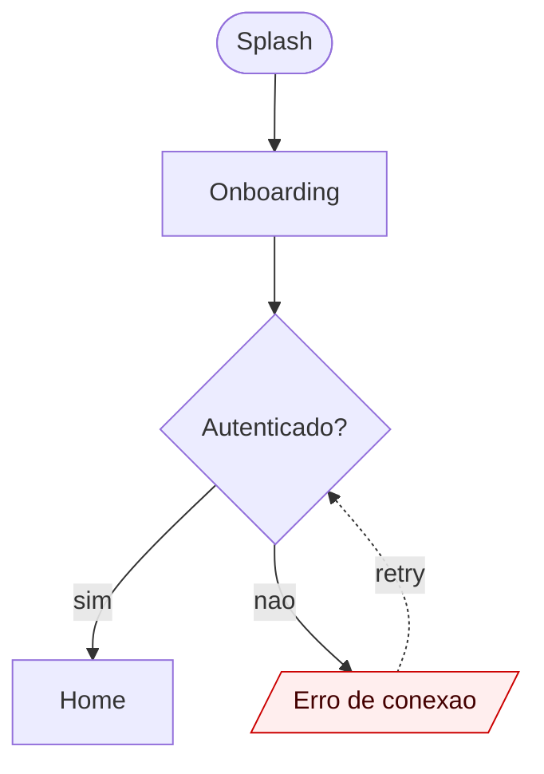
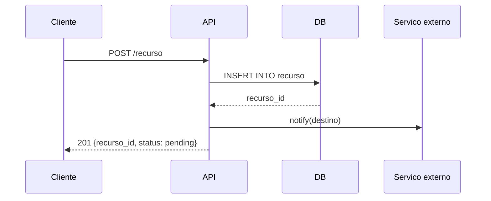

# mermaid-flow

Skill para gerar diagramas Mermaid (.mmd) consistentes para diferentes tipos
de fluxos no projeto.

## Quando invocar
- Documentar fluxo de um perfil de usuario (qualquer ator do dominio)
- Visualizar arquitetura de modulo ou integracao
- Mapear sequencia de chamadas API/DB para uma operacao critica

## Tipos de diagrama

### 1. Fluxograma UX (telas + decisoes do usuario)
- Salvar em `docs/flows/<perfil>-ux.mmd`
- Sintaxe: `flowchart TD` ou `flowchart LR`
- Nos = telas; decisoes = losangos; setas = transicoes
- Marcar estados especiais com classes: empty, error, loading

### 2. Fluxograma tecnico (estados + endpoints + DB)
- Salvar em `docs/flows/<perfil>-tech.mmd`
- Sintaxe: `sequenceDiagram` para sequencias temporais
- Atores: Cliente, API, DB, Servico externo
- Anotar endpoints REST/GraphQL, queries SQL, mensagens

### 3. Arquitetura de sistema
- Salvar em `docs/architecture/<modulo>.mmd`
- Sintaxe: `graph TB` ou `C4Component`
- Marcar boundaries de servico e fontes de verdade

## Convencoes
- Sempre incluir titulo via comentario `%% <Titulo do diagrama>`
- Usar IDs curtos mas legiveis (ex.: `LOGIN`, `HOME`, `ORDER_CREATE`)
- Cores via classDef para destacar nos criticos
- Maximo ~30 nos por diagrama; se ultrapassar, quebrar em sub-diagramas

## Template UX

## Template tecnico

